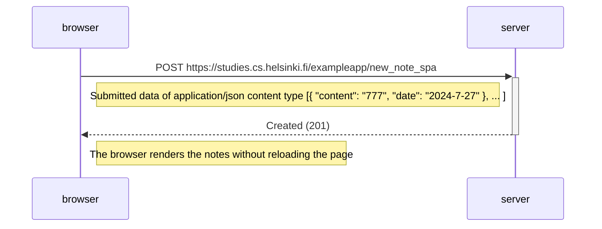

  Shovan full stack open

```mermaid

sequenceDiagram
    participant browser
    participant server

    browser->>+server: POST https://studies.cs.helsinki.fi/exampleapp/new_note_spa
     Note right of browser: Submitted data of application/json content type [{ "content": "777", "date": "2024-7-27" }, ... ]
    server-->>-browser: Created (201)
    

    Note right of browser: The browser renders the notes without reloading the page
```